# Full-Stack App: React + Golang Fiber

A modern full-stack web application with **React (TypeScript)** frontend and **Golang (Fiber)** backend. Features JWT authentication, role-based access control (RBAC), CRUD operations, and CSV export.

## 📸 Screenshots

### 🔐 Authentication

<table>
  <tr>
    <td>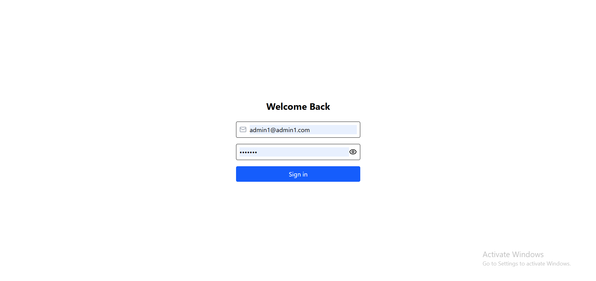</td>
    <td>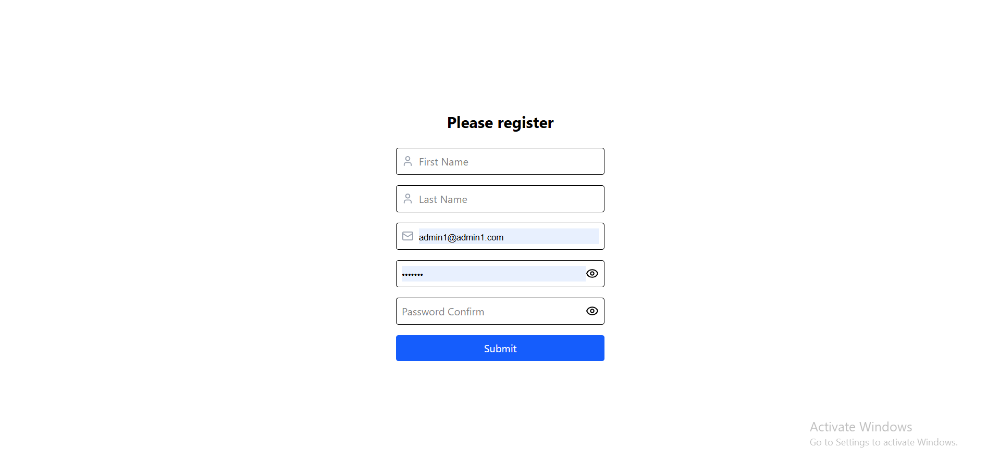</td>
  </tr>
</table>

### 📊 Dashboard

<table>
  <tr>
    <td>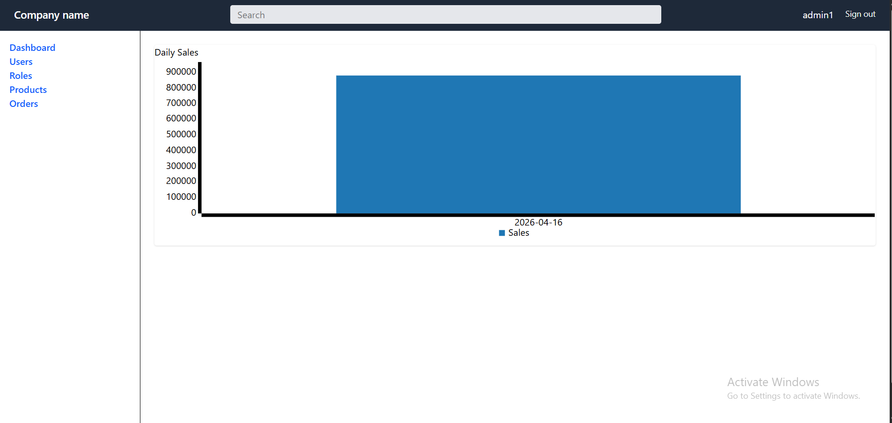</td>
  </tr>
</table>

### 👥 Users

<table>
  <tr>
    <td>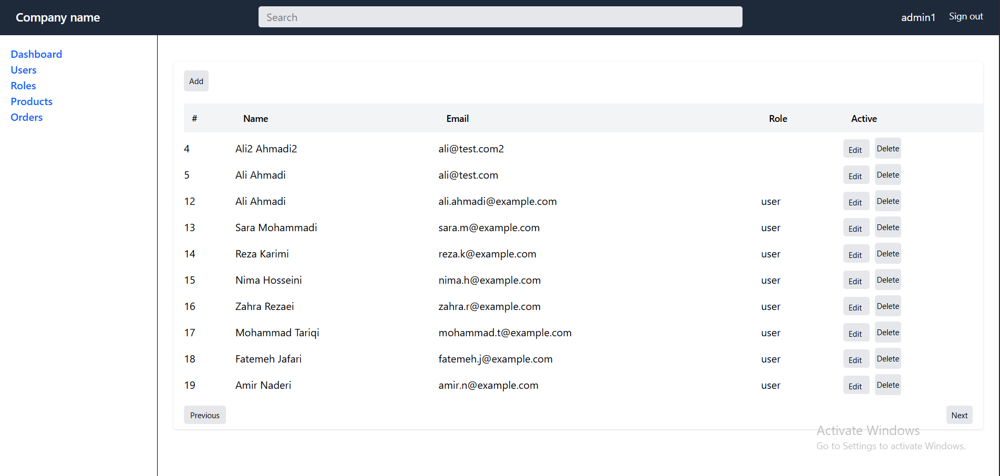</td>
    <td>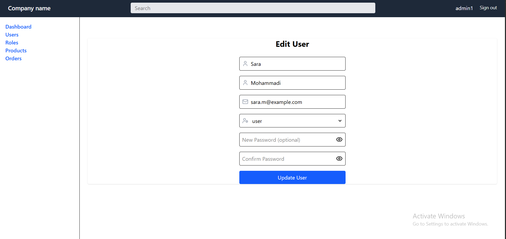</td>
    <td>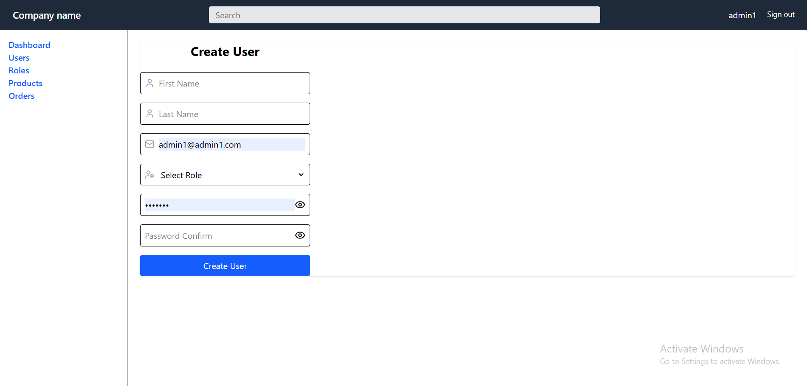</td>
  </tr>
</table>

### 🧑‍💼 Roles

<table>
  <tr>
    <td>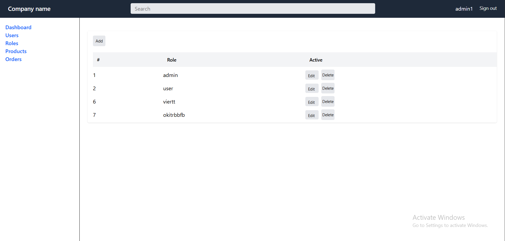</td>
    <td>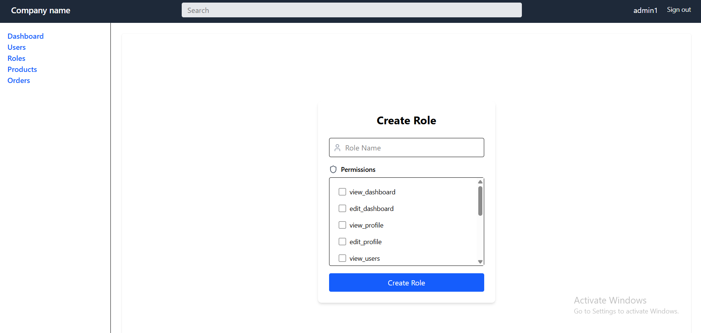</td>
    <td>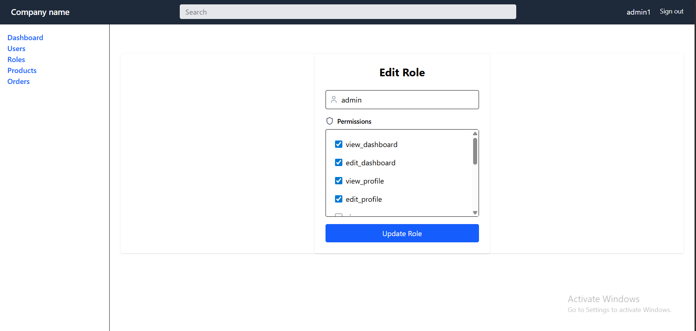</td>
  </tr>
</table>

### 📦 Products

<table>
  <tr>
    <td>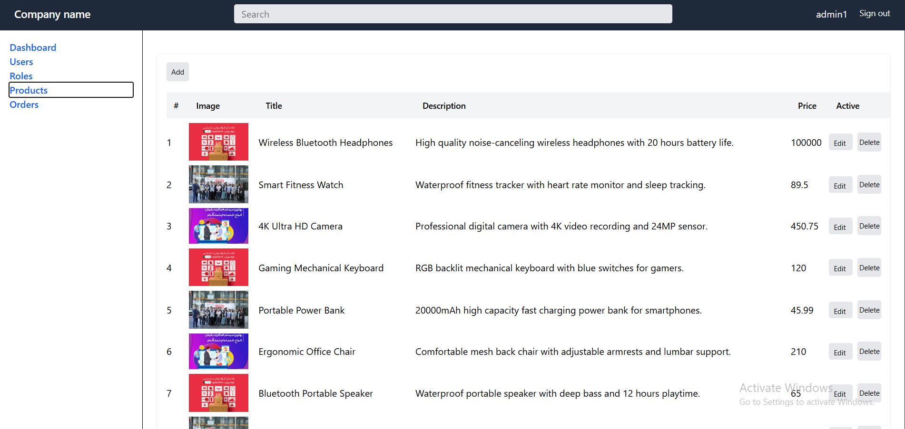</td>
    <td>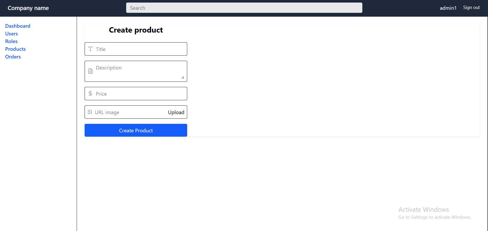</td>
    <td>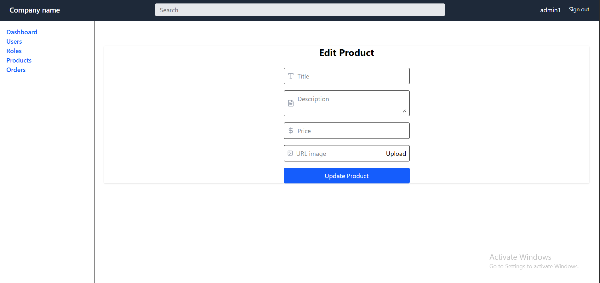</td>
  </tr>
</table>

### 🛒 Orders

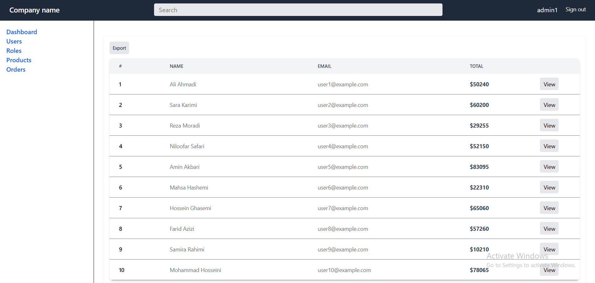

### 🧑 Profile

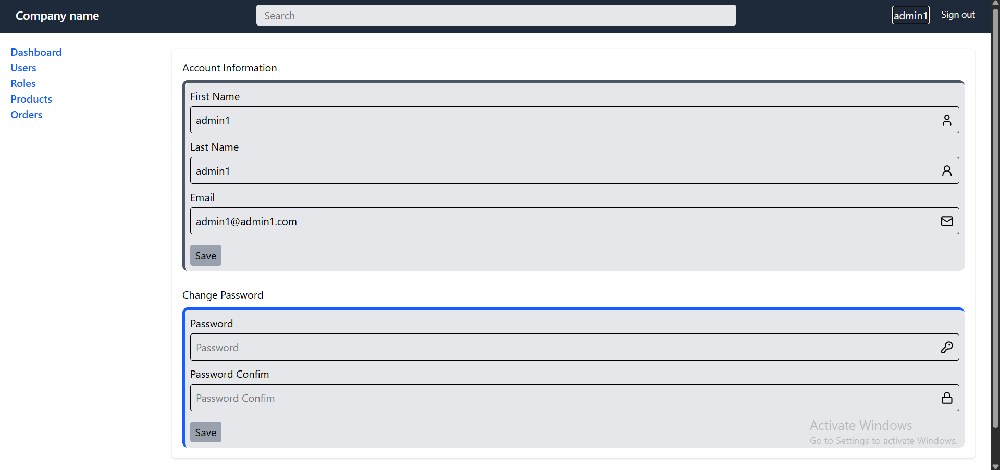

## 🛠 Tech Stack

### Frontend

- React 19 + TypeScript
- React Router Dom v6
- React Hook Form + Zod
- Tailwind CSS
- Axios

### Backend

- Golang + Fiber
- GORM (ORM)
- JWT Authentication
- PostgreSQL

## ✨ Features

- **Authentication & Authorization**
  - JWT stored in HTTP‑only cookies
  - Password hashing with bcrypt
  - Role‑based access control (Admin / User / Manager)

- **Core Modules**
  - Products CRUD (Create, Read, Update, Delete)
  - Orders management
  - One‑click CSV export (Orders, Users, Products)
  - User & Role management (Admin only)

## 📁 Project Structure

| Path | Description |
| :--- | :--- |
| `frontend/src/components/pages/` | Login, Register, Dashboard, Products, Users, Orders, Profile |
| `frontend/src/components/` | Reusable UI components |
| `backend/controllers/` | Request handlers (Fiber) |
| `backend/models/` | GORM models |
| `backend/middleware/` | JWT and RBAC middleware |
| `backend/routes/` | API route definitions |
| `backend/main.go` | Application entry point |

## 🚀 Getting Started

### Backend

```bash
cd backend
go mod tidy
# set DB_URL and JWT_SECRET in .env
go run main.go


cd frontend
npm install
npm run dev
```
